# EasyCart E-commerce Project

Welcome to the easy-cart e-commerce project! This project is a fully functional e-commerce web application developed using the MERN (MongoDB, Express.js, React.js, Node.js) stack. The application is designed to provide a seamless shopping experience for users and a robust management interface for administrators.

## Table of Contents
- [Introduction](#introduction)
- [Features](#features)
  - [User Features](#user-features)
    - [Login Page](#login-page)
    - [Google Sign-in Page](#google-signin-page)
    - [Register Page](#register-page)
    - [Home Page](#home-page-users)
    - [All Products Page](#all-products-page)
    - [Category Page](#category-page)
    - [Product Page](#product-page)
    - [Wishlist Page](#wishlist-page)
    - [Order Page](#order-page)
    - [Cart Page](#cart-page)
    - [Payment Page](#payment-page)
    - [Profile Page](#profile-page)
  - [Admin Features](#admin-features)
    - [Admin Home Page](#admin-home-page)
    - [Dashboard Page](#dashboard-page)
    - [User Management Page](#user-management-page)
    - [Add Product Page](#add-product-page)
    - [Product Management Page](#product-management-page)
    - [Order Management Page](#order-management-page)
- [Resources Used](#resources-used)
- [Installation](#installation)
- [Usage](#usage)
- [Screenshots](#screenshots)
- [Contributing](#contributing)
- [License](#license)

## Introduction
easy-cart is a responsive and user-friendly e-commerce web application. It allows users to browse products, add them to a cart or wishlist, and make secure payments using the integrated Stripe payment gateway. The application also features an admin panel for managing products, users, and orders.

## Features

### User Features

#### Login Page
Users can log in to the application using their email and password. We implemented secure authentication mechanisms to ensure user data protection.
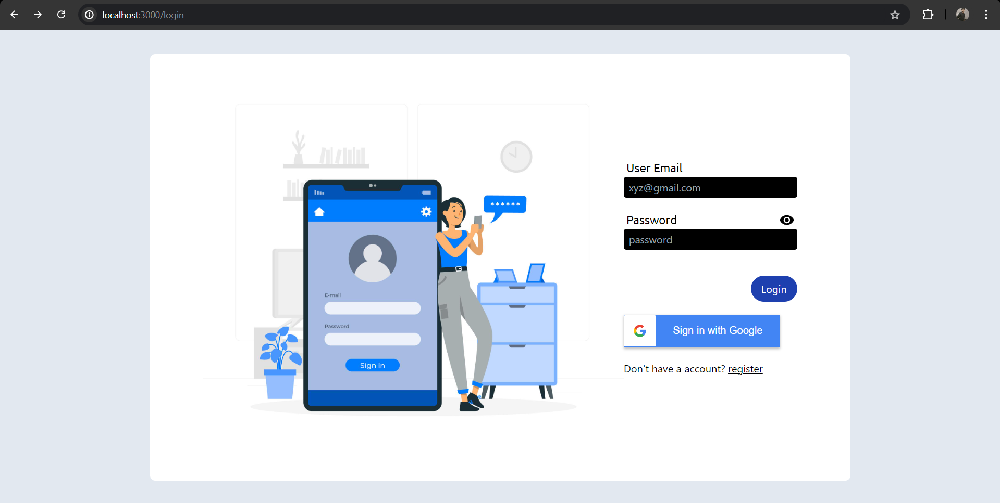

#### Google Sign-in Page
Users have the option to log in using their Google account for a faster and more convenient authentication process.
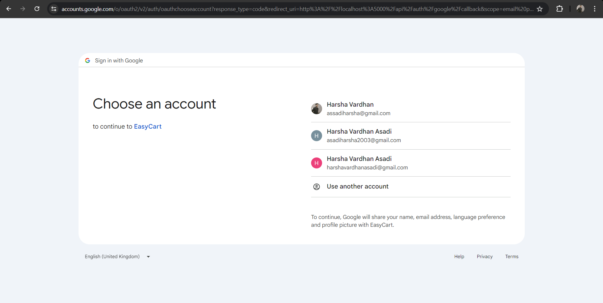

#### Register Page
New users can register for an account by providing their details, including name, email, and password.
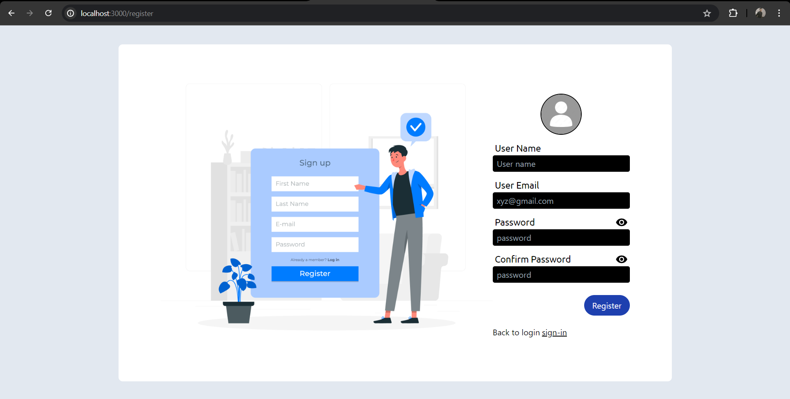

#### Home Page (Users)
The home page displays a welcoming interface with featured products, categories, and promotions. Users can easily navigate through various sections.
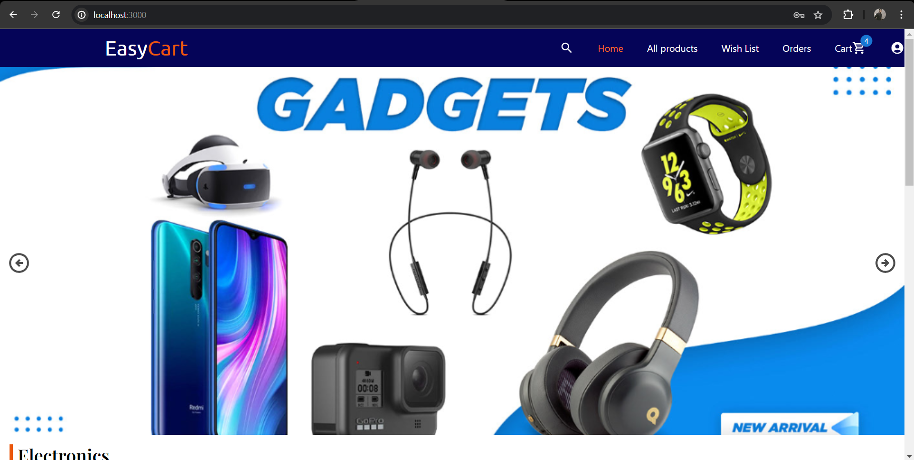

#### All Products Page
This page lists all available products. Users can sort and filter products based on different criteria such as price, popularity, and category.
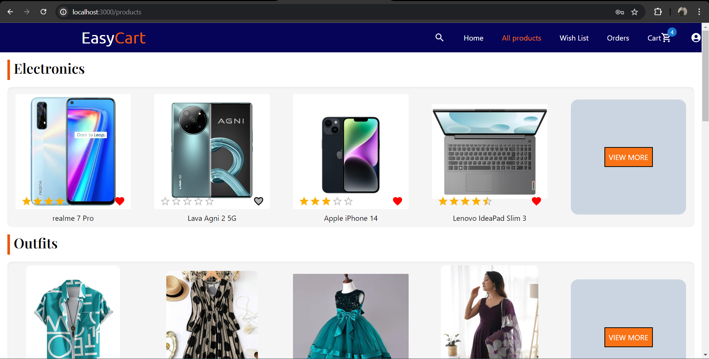

#### Category Page
Users can browse products by category. Each category page displays products that belong to a specific category.
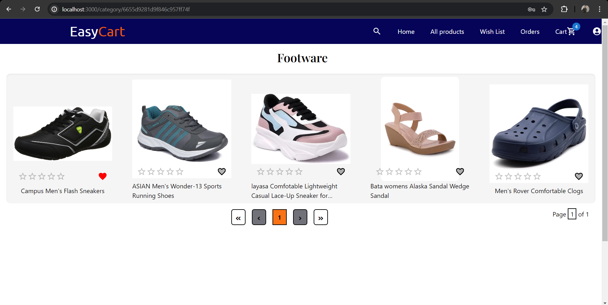

#### Product Page
Detailed information about a product is provided on this page, including images, descriptions, features, price, and user reviews.
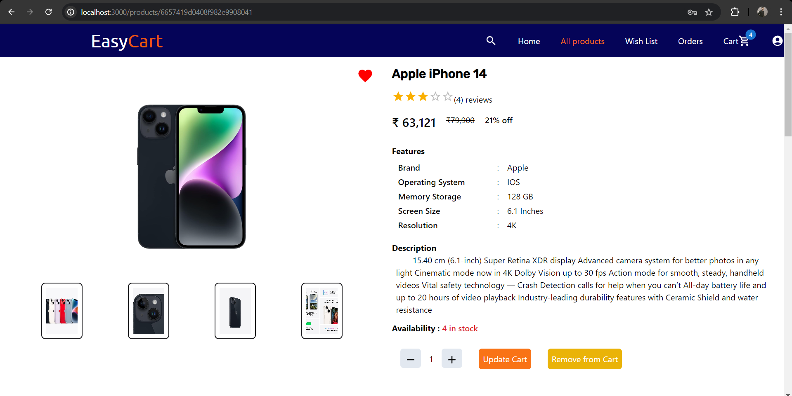
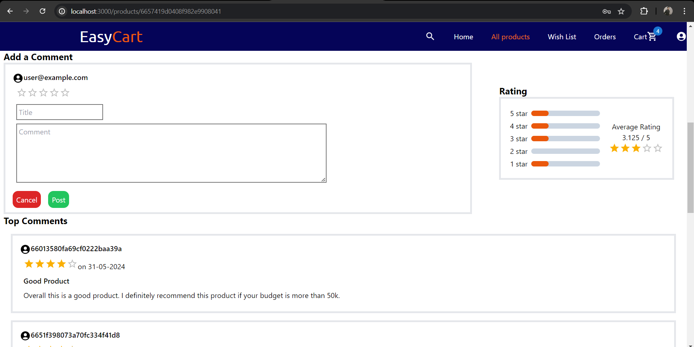

#### Wishlist Page
Users can add products to their wishlist for future reference. The wishlist page shows all the products that a user has added to their wishlist.
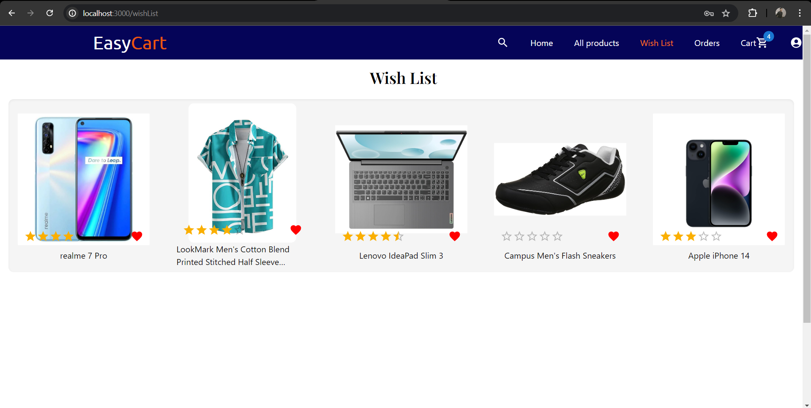

#### Order Page
Users can view their past and current orders, track the status of their orders, and see detailed information about each order.
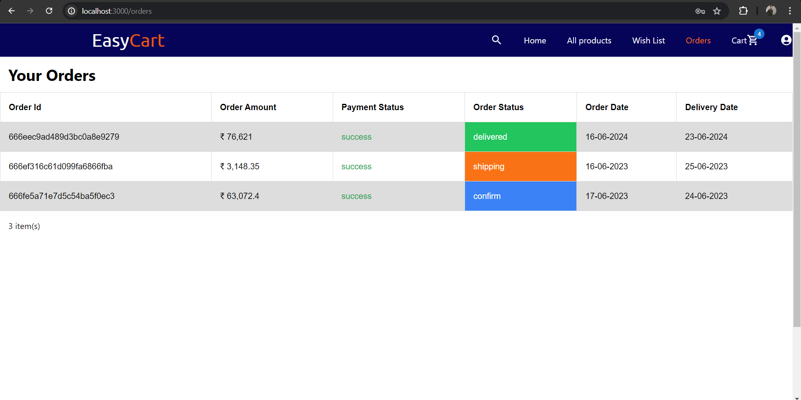

#### Cart Page
The cart page displays all the products that a user has added to their cart. Users can adjust quantities, remove items, and proceed to checkout.
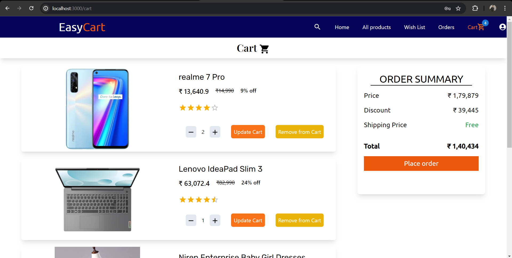

#### Payment Page
We integrated Stripe for secure payments. Users can enter their payment information and complete their purchases.
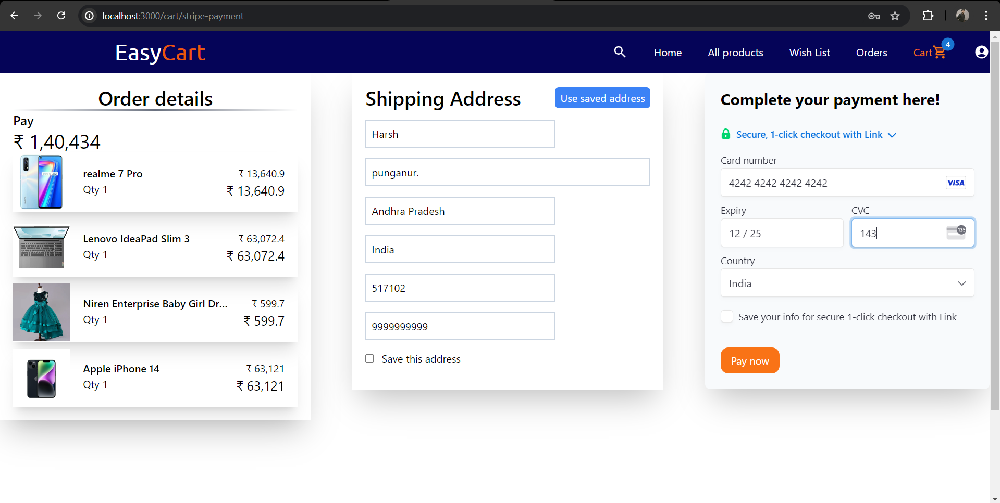
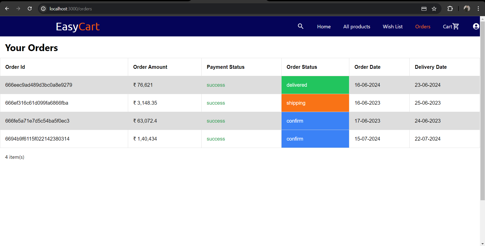

#### Profile Page
Users can view and edit their profile information, including personal details and saved addresses.
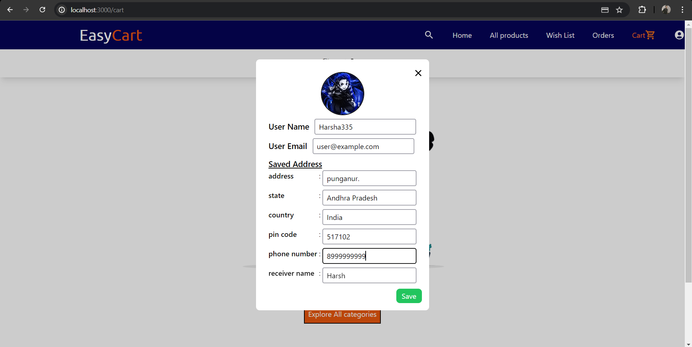

### Admin Features

#### Admin Home Page
The admin home page provides an overview of the admin functionalities and quick links to various management pages.
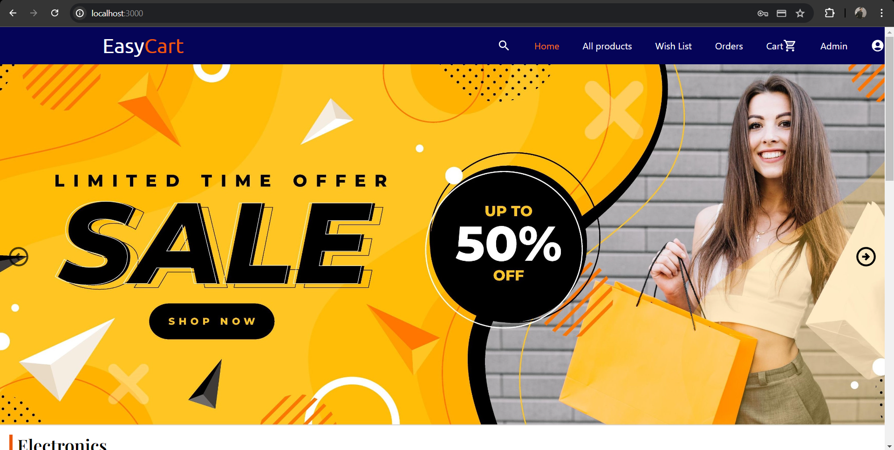

#### Dashboard Page
The dashboard provides a summary of key metrics such as monthly sales, top purchased products, and user statistics.
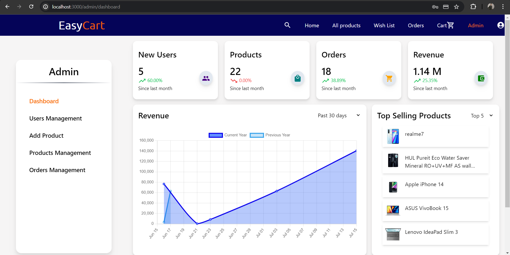

#### User Management Page
Admins can view, edit, and delete user accounts. The page also provides information about user activity and order history.
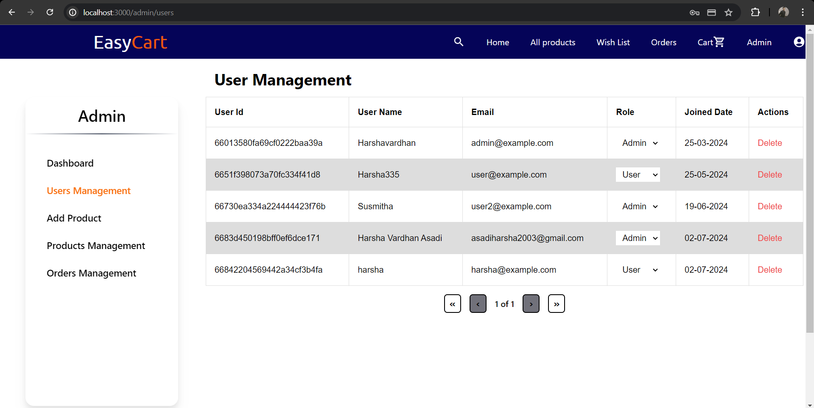

#### Add Product Page
Admins can add new products by providing product details, images, and other relevant information.
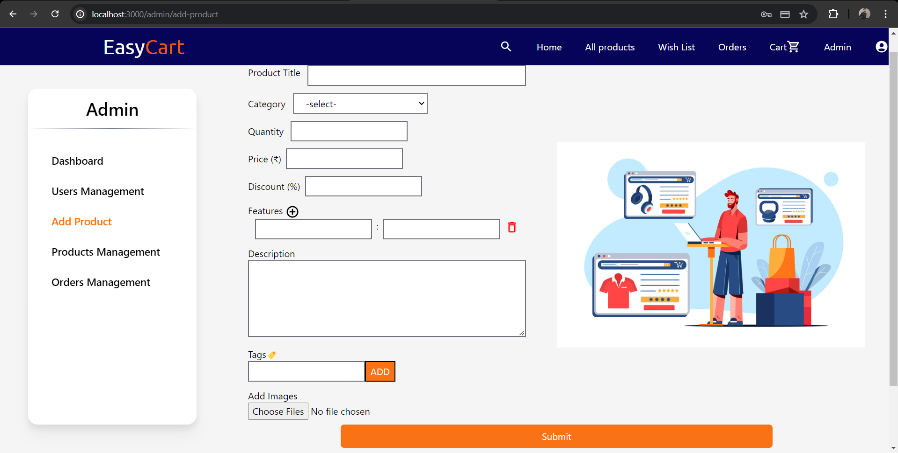

#### Product Management Page
This page allows admins to manage existing products, including editing details, updating stock, and deleting products.
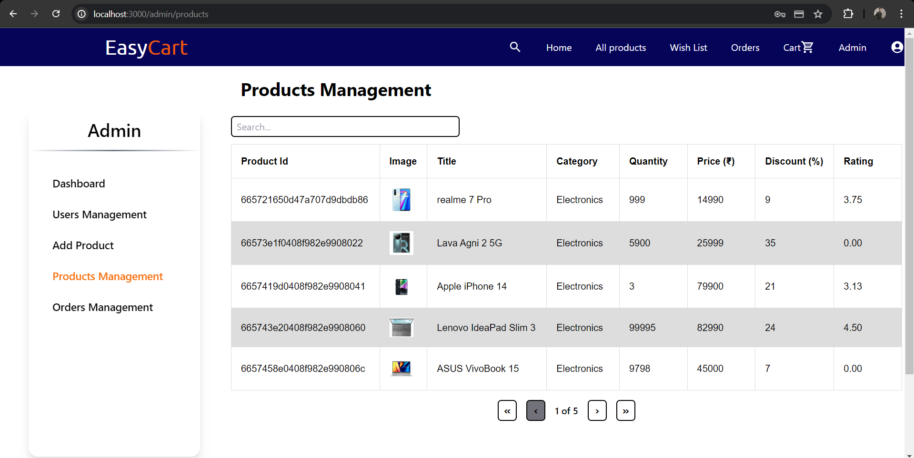
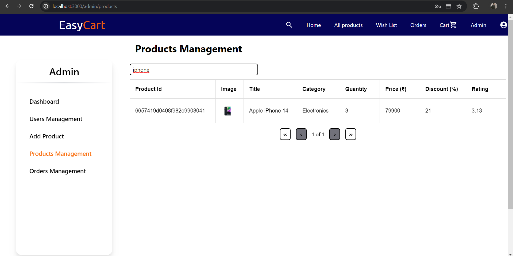

#### Order Management Page
Admins can view and manage all orders, update order statuses, and track shipment information.
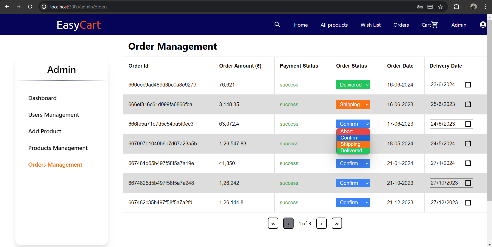

## Resources Used
- **React.js**: Frontend library
- **Node.js**: Backend runtime environment
- **Express.js**: Backend framework
- **MongoDB**: Database
- **Mongoose**: MongoDB object modeling tool
### Other Resources Used
- **Axios**: HTTP client
- **nodemon**: Restart server on changes
- **reduxjs/toolkit**: Central Store details
- **mui/icons-material**: Material UI icons
- **jsonwebtoken**: JWT token
- **tailwind**: easy CSS with responsive
- **react-chartjs-2**: Display charts effectively
- **crypto-js**: Encryption
- **Stripe**: Payment gateway
- **multer**: Image storage
- **Cloudinary**: Image storage

## Installation
1. Clone the repository:
   ```bash
   git clone https://github.com/harsha335/easy-cart.git
   ```
2. Navigate to the project directory:
   ```bash
   cd easy-cart
   ```
3. Install dependencies for both backend and frontend:
   ```bash
   cd frontend
   npm install
   cd ../backend
   npm install
   ```
4. Create a `.env` file in the root directory and add your environment variables.

## Usage
1. Start the backend server:
   ```bash
   npm run dev
   ```
2. Start the frontend development server:
   ```bash
   cd client
   npm start
   ```

## Contributing
Contributions are welcome! Please open an issue or submit a pull request for any changes or enhancements.

## License
This project is licensed under the MIT License. See the [LICENSE](LICENSE) file for details.

---

Feel free to add any additional information or modify the content as needed.